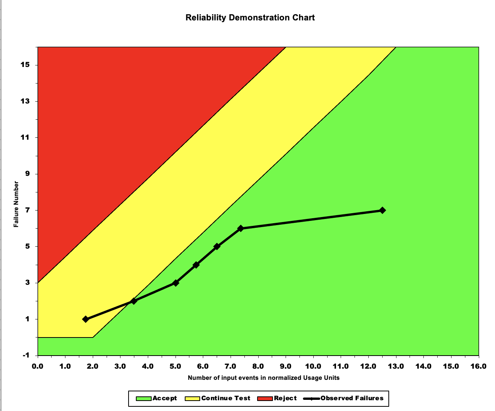
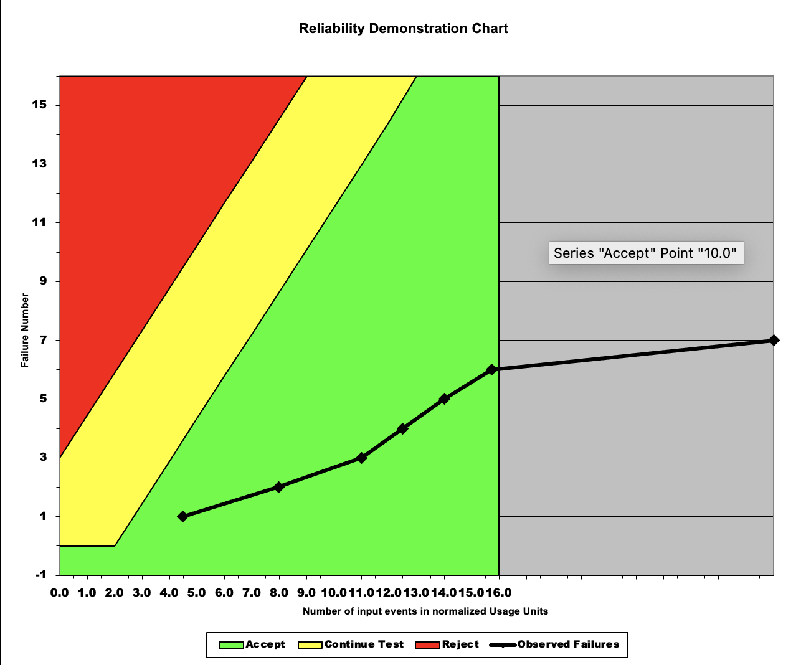
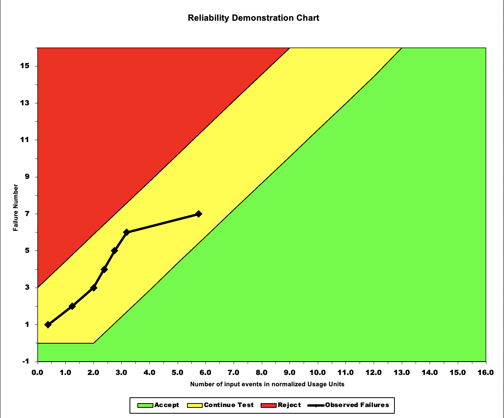

**SENG 438- Software Testing, Reliability, and Quality**

**Lab. Report \#5 – Software Reliability Assessment**

| Group \#5:        |
| ------------------|
| Ethan Rigby       |
| Labib Afsar Ahmed |
| Mohammed Alshoura |
| Danielle Jourdain |

# Introduction

# Assessment Using Reliability Growth Testing

# Assessment Using Reliability Demonstration Chart

For the Reliability Demonstration Chart, we used Failure Report 10. The data was translated from its tabular form into the format needed for the Excel sheet. Each column was 1 failure and the time was calculated based on a base time. We chose to use RDC-11 to plot the reliability demonstration chart. Due to the limit of 16 data points, we plotted the first 16 failures of the system.

We chose the risk values as follows:

- Discrimination ratio: 2
- Developer's risk: 0.1
- User's risk: 0.1

We found the minimum MTTF by running several different test cases to see what produced an acceptable graph. For this data set, we found that 6 failures per 1,000,000 was the maximum amount of failure that was acceptable. PUT MTTF CALCULATION IN HERE. We decided this was the minimum acceptable MTTF since the graph was mostly in the "accept" region, with very little in the "continue test" region. This way the system was acceptable for most of its lifespan.

Next, we ran several different "what-if" cases to see how the system would be affected by different acceptable failure values. First, we doubled the amount of acceptable failures, setting it to 12 failures per 1,000,000 calls. Because more failure is accepted, the system is very clearly accepted throughout its entire life.

The last case we ran was halving the number of acceptable failures, setting it to 3 per 1,000,000 calls. By reducing the number of acceptable failures, the system is not as acceptable as it previously was. Thankfully, the system does not enter into "reject" region, but it is firmly in the "continue testing" regoin. If this was the desired amount of failure, the system would require more testing.

ADD MORE ANALYSIS HERE

# Comparison of Results

# Discussion on Similarity and Differences of the Two Techniques

# How the team work/effort was divided and managed

Because of the issues running the software on Mac, we split the lab into two parts. The reliability growth testing portion was handled by our two group members who use Windows. The second half, using the RDC was handled by the two members who used Mac, using the RDC-11 Excel sheet.

# Difficulties encountered, challenges overcome, and lessons learned

There were more difficulties encountered than we can even begin to describe in this report.

The first difficulty was with SRTAT. Half of our team uses MacOS, and they were not able to run this program. We then moved on to C-SFRAT, which also did not work on MacOS. Neither software worked with the data provided, even when converted to a CSV file rather than the given DAT file. There was no information on what format the data needed to be in, leaving us to flounder and guess what the programs were looking for.

Moving on to the second half of the lab, even more difficulties were encountered. Once again SRTAT does not work on MacOS. Attemting to use RDC-11 also provided a new array of issues. The first one was the lack of instruction other than "fill in the data." There is no documentation on how the sheet works either from the createors or the teaching team. Every single set of failure data is in a different format, so we had no idea which one to use or how to use it. When we attempted to choose one and import the data into RDC-11, we found that the values we had were locked in the spreadsheet.

# Comments/feedback on the lab itself

This lab was incredibly frustrating and diffcult to complete. The expectations were incredibly unclear, and even when the students requested clarification, none was offered. This lab forced us to think outside of the box and find new ways to solve problems the course failed to prepare us for. In future years, reconsider this entire assignment and the software used. All of the software was incredibly outdated and was difficult if not impossible to use on a modern operating system.
